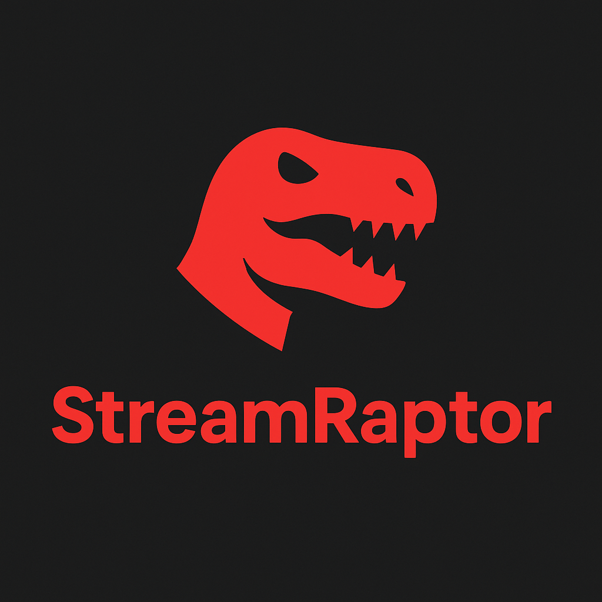
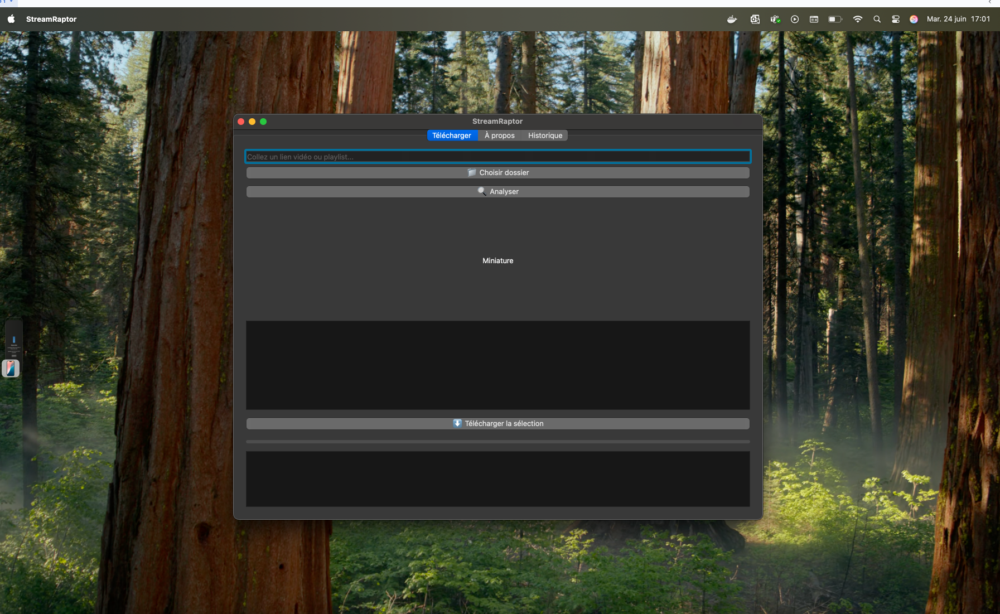
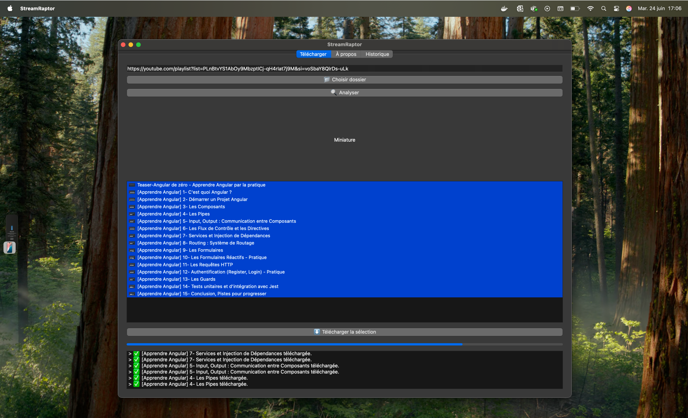
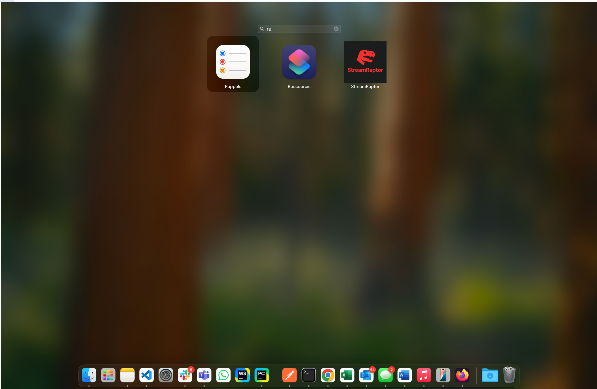

# 🎬 StreamRaptor



**StreamRaptor** est une application moderne, élégante et puissante qui vous permet de télécharger des **vidéos, playlists, images** depuis :

- 🎥 **YouTube** (vidéos & playlists)
- 🎵 **TikTok**
- 📘 **Facebook**
- 📌 **Pinterest**
- 💼 **LinkedIn**

Développée en **Python** avec **PySide6**, l’interface rappelle l’esthétique de **Netflix** pour une expérience utilisateur premium.

---

## 🚀 Fonctionnalités

- ✅ Téléchargement de vidéos & playlists YouTube
- ✅ Sélection multiple de vidéos d'une playlist
- ✅ Affichage des miniatures
- ✅ Interface graphique moderne (Netflix-like)
- ✅ Zone de logs en bas
- ✅ Historique des téléchargements
- ✅ Barre de progression en temps réel
- ✅ Téléchargement audio / vidéo selon format
- ✅ Choix du dossier d’enregistrement
- ✅ Multiplateforme : **macOS** & **Windows**

---

## 📥 Téléchargement

| Plateforme | Lien |
|-----------|------|
| 🖥️ **macOS (.dmg)** | [Télécharger StreamRaptor.dmg](https://drive.google.com/file/d/1kcgL7QU_o-L4zyjH06GH7pJy5zgU3YmF/view?usp=sharing) |
| 🪟 **Windows (.msi/.exe)** | [Télécharger StreamRaptor.exe](https://drive.google.com/file/d/1c3ESV7njx_idNl_pjrWhcd7lQ4SLwnya/view?usp=sharing) |

---

## 🖼️ Captures d’écran

### Home


### Downlaods


### On Mac


### History


### Credits


---

## 🧑‍💻 Installation pour les développeurs

### ⚙️ Prérequis

- Python 3.9+
- pip
- [yt-dlp](https://github.com/yt-dlp/yt-dlp)

### 🧪 Étapes

```bash
git clone https://github.com/daniel10027/streamraptor.git
cd streamraptor
python -m venv .env
source .env/bin/activate  # ou .env\Scripts\activate sous Windows
pip install -r requirements.txt
python main.py
````

---

## 🛠️ Création d’un exécutable

### Pour macOS :

```bash
pyinstaller main.py \
  --windowed \
  --name "StreamRaptor" \
  --icon="streamraptor/assets/icons/video.png" \
  --add-data "streamraptor/assets:streamraptor/assets"
```

Puis pour le `.dmg` :

```bash
create-dmg \
  --volname "StreamRaptor" \
  --volicon "streamraptor/assets/icons/video.icns" \
  --background "streamraptor/assets/icons/background.png" \
  --window-size 500 300 \
  --icon-size 100 \
  --icon "StreamRaptor.app" 130 150 \
  --app-drop-link 370 150 \
  dist/StreamRaptor.dmg \
  dist/
```

### Pour Windows :

Depuis un **Windows natif ou une VM** :

```bash
pyinstaller main.py ^
  --windowed ^
  --name "StreamRaptor" ^
  --icon=streamraptor/assets/icons/video.ico ^
  --add-data "streamraptor/assets;streamraptor/assets"
```

---

## 🧠 Technologies

* `Python 3.9+`
* `PySide6` : interface graphique
* `yt-dlp` : extraction audio/vidéo
* `QThread` : traitement asynchrone
* `requests` : récupération des miniatures

---

## 👨‍🎨 Crédits

* Développement : **Daniel Guedegbe 🇨🇮**
* Design : Inspiré de **Netflix**
* Logo & icônes : générés par **IA**
* Projet personnel et éducatif

---

## 📜 Licence

**MIT** – Libre pour tout usage personnel ou professionnel.# streamraptor
